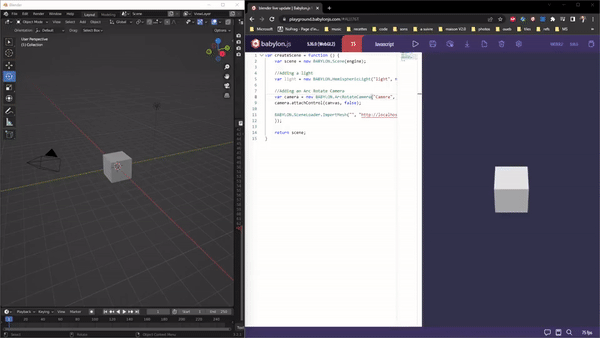

# Blender Live Update
Live HTTP/GLTF2 link between Blender and any tool that can stream assets like Babylon.js Playground.

## Installation
Run `BlenderLiveUpdate.py` in Blender

## Usage
Once the script is running, each time a HTTP request is done on localhost at port 8080 (default), a gltf2 file from the Blender scene is generated and streamed as the result of the request.
Everything allowed by gltf2 will be exported (cameras, lights, material,...)

For example, in Babylon.js playgrounds, this code will load the produced export. Each time the play button is pressed, the scene is refreshed.
https://playground.babylonjs.com/#AUJ76T

## Improvements
Any PR is welcome.
